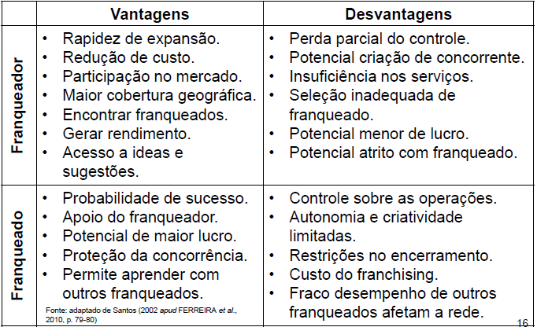
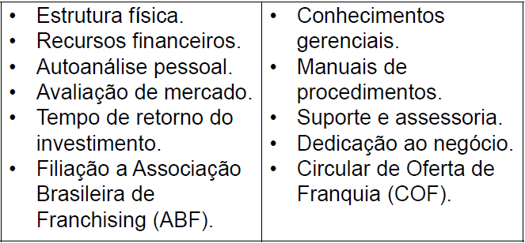

[Introdução](#Introdução)

[Definições de empreendedorismo](#definições-de-empreendedorismo)

[Campos de estudo](#campos-de-estudo)

[Breve histórico](#breve-histórico-do-empreendedorismo)

[Tipos de empreendedorismo](#tipos-de-empreendedorismo)

[Intraempreendedorismo](#intraempreendedorismo)

[Franquias](#franquia-como-forma-de-empreendedorismo)

[O papel social e econômico](#o-papel-social-e-econômico-do-empreendedorismo)

[Considerações finais](#considerações-finais)

# Objetivos de aprendizagem
•Conceituar e contextualizar o empreendedorismo.

•Compreender os tipos de empreendedorismo.

•Estabelecer a importância socioeconômica.

# Definições de empreendedorismo

• O empreendedorismo está presente no nosso cotidiano com papel essencial no desenvolvimento social e econômico.

• Para Dornelas (2005, p. 29), “a palavra empreendedor (entrepreneur) tem origem francesa e quer dizer **aquele que assume riscos e começa algo novo**”.

• Para Shane e Venkataraman (2000 apud BARON; SHANE, 2010), o “empreendedorismo, como uma **área de negócios**, busca entender como surgem as oportunidades para **criar algo novo** (produtos ou serviços, mercados, processos de produção ou matérias-primas, formas de organizar as tecnologias); **como são descobertas ou criadas por indivíduos** específicos que, a seguir, **usam meios diversos para explorar ou desenvolver coisas novas.**”

•Read et al. (2011, pp. 17-18) sintetizam da seguinte forma:

•**Ideia** = alguma coisa + você.

•**Oportunidade** = ideia + ação.

•**Ação** = função (interação) do dinheiro, produto e parceiros.

•**Viabilidade** = oportunidade + comprometimento.

### Definição de empreendedor

•Para Lacombe e Heilborn (2008, p. 128), é a “pessoa que percebe oportunidades de oferecer no mercado novos produtos, serviços e processos e tem coragem para assumir riscos e habilidades”.

•Vale ressaltar que o empreendedor sozinho pode ter a ideia e transformar em negócio, ou também com a ajuda de mais pessoas.

# Campos de estudo

• É possível encontrar mais de 25 campos. O material complementar de Filion mostra, com detalhes, cada área.

• Algumas das áreas comumente conhecidas são jovens, mulheres, mortalidade de empresas, empreendedorismo social e 
cultura.

• Como estuda fenômenos sociais, sempre existem particularidades a serem estudadas.

# Breve histórico do empreendedorismo

• Marco Polo e criação da rota comercial.

• Idade Média com gerenciamento de projetos.

• Século XVIII a separação entre empreendedor de capitalista.

• No Brasil, começou, em 1990, com a criação do SEBRAE e Softex.

• Vivemos a Era do Empreendedorismo para Dornelas.

# Tipos de empreendedorismo

• **Empreendedor nato** - mitológico.

• **Empreendedor que aprende** - inesperado.

• **Empreendedor serial** – criar novos negócios.

• **Empreendedor corporativo/intraempreendedor**.

• **Empreendedor social** – missão social.

• **Empreendedor por necessidade** – única alternativa.

• **Empreendedor por herdeiro** – sucessão familiar.

• **Empreendedor normal** - planejado.

# Intraempreendedorismo

• É um processo que ocorre dentro de uma empresa existente, independente de seu porte, e a leva não somente a novos negócios, mas também a outras atividades e orientações inovadoras, como o desenvolvimento de novos produtos, serviços, tecnologias, técnicas administrativas, estratégias e posturas competitivas (MONTENEGRO, 2012).

• Na era da hipercompetição, a necessidade de inovações e de criatividade estabelece a necessidade de desenvolver um clima intraempreendedor nas organizações (HISRICH; PETERS, 2004).

### Principais diferenças entre a cultura tradicional e a cultura intraempreendedora

# Franquia como forma de empreendedorismo

• Palavra franchising tem origem francesa que significa **concessão de um privilégio ou de uma autorização** (FERREIRA et al., 2010).

• “É um negócio que essencialmente consiste de uma organização (o franqueador) com um pacote de negócio testado em mercado, centrado num produto ou serviço, entrando em um relacionamento contratual com franqueados, tipicamente pequenas firmas autofinanciadas e autogeridas, operando sob a marca registrada do franqueador para produzir e/ou comercializar bens e serviços de acordo com um formato especificado pelo franqueador” (STANWORTH, 2004 apud GIGLIOTTI, 2012, p. 5).

• Aspectos fundamentais para analisar nas franquias:

# O papel social e econômico do empreendedorismo

• De acordo com Stoner e Freeman (1999) os benefícios gerados pelo empreendedorismo por meio da criação de novos negócio são:

•Contribui para o **crescimento econômico.**

•Promove ganhos com a **produtividade**.

•Realiza **investimentos em pesquisas e desenvolvimento.**

• Conforme Dornelas (2005) é preciso estimular o empreendedorismo por oportunidade.

• Para Julien (2010), deve existir o olhar mais voltado ao local, pois é importante incentivar o **desenvolvimento e o atendimento de demandas locais**. Se a região não oferece condições propícias, os empreendedores terão dificuldade em manter o negócio aberto e outras possíveis **organizações migrarão para outro local**, comprometendo o futuro. Se a região for mais dinâmica e tiver mais opções, pode abrigar essas entidades. O empreendedorismo **tem impacto sobre o mercado, o meio e a sociedade.**

# Considerações finais

• O empreendedorismo envolve a combinação de indivíduos e recursos que criam novos produtos, serviços, mercados, processos de produção e formas de organização.

• Existem diferentes formas de empreender.

• Importância social e econômica do empreendedorismo.

• Para os cursos ligados à gestão, estudar empreendedorismo é uma forma de compreender como está a dinâmica do mercado.