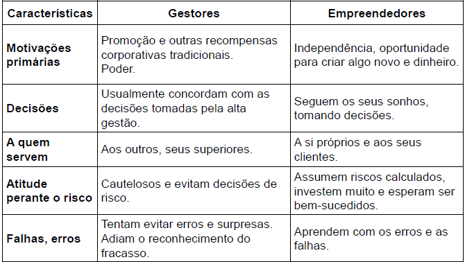
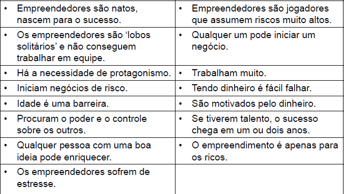
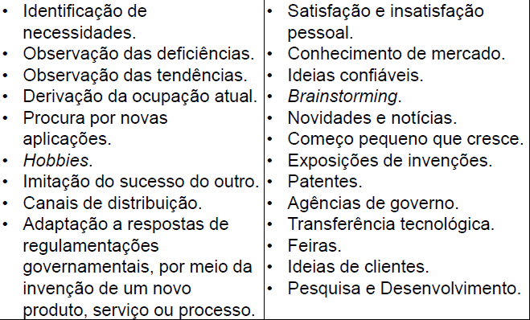
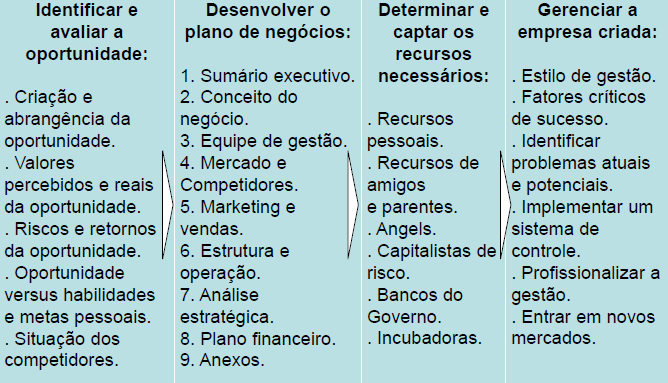
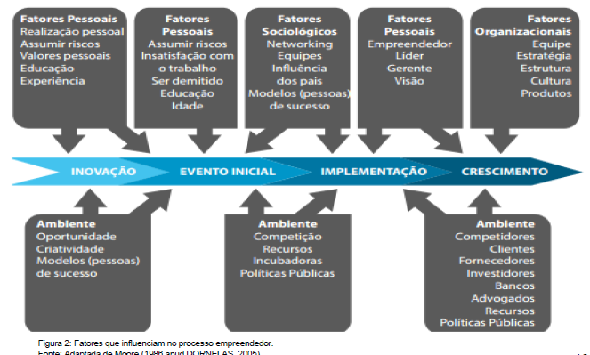
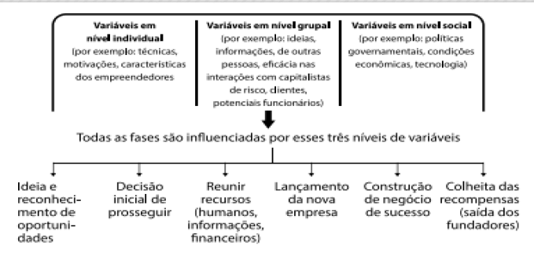

# Tópicos

[Características e perfil empreendedor](#características-empreendedoras)

[Diferenciando empreendedor de gestor](#diferenciando-empreendedor-de-gestor)

[Mitos sobre empreendedores e empreendedorismo](#mitos-sobre-empreendedores-e-empreendedorismo)

[A necessidade de formação do empreendedor](#a-necessidade-de-formação-do-empreendedor)

[Oportunidade empreendedora](#oportunidade-empreendedora)

[Fontes de oportunidades empreendedoras](#fontes-de-oportunidades-empreendedoras)

[O processo empreendedor](#o-processo-empreendedor)

[Considerações finais](#considerações-finais)

# Objetivos de aprendizagem

•Identificar as principais características que compõem perfis empreendedores.

•Conhecer os mitos do empreendedorismo.

•Discutir a formação do empreendedor.

•Conhecer organizações que promovem o empreendedorismo.

•Compreender oportunidade empreendedora.

•Identificar fontes de oportunidades empreendedoras.

•Conhecer o processo empreendedor.

# Características empreendedoras

• É importante destacar que **não existe um modelo pronto**, de maneira que todo empreendedor tenha que, obrigatoriamente, ter todas as características classificadas como empreendedoras.

• Aspectos da história do empreendedor, como **ambiente familiar, educação, valores pessoais, experiência profissional** influenciam na forma de empreender (FERREIRA et al, 2010).

•Dornelas (2005) diz que algumas características estão implícitas a qualquer definição de empreendedor:

•**Ter iniciativa para criar um novo negócio e paixão pelo que faz.**

•**Transformar o ambiente, utilizando recursos disponíveis de forma criativa.**

•**Aceitar correr riscos calculados.**

# [👆 TÓPICOS](#tópicos)

# Diferenciando empreendedor de gestor

# [👆 TÓPICOS](#tópicos)

# Mitos sobre empreendedores e empreendedorismo

# [👆 TÓPICOS](#tópicos)

# A necessidade de formação do empreendedor

• **A formação empreendedora contribui para o sucesso dos negócios** que já existem ou que ainda estão em fase de implementação.

• A profissionalização de cada um deles, bem como os benefícios que eles trazem à sociedade depende de empreendedores bem preparados para isso.

• **Caso contrário, ele correrá sérios riscos de ser nocauteado pelas dificuldades do mercado e evitará entrar e ficar perdido num labirinto.**

•**Habilidades técnicas** - saber escrever, ouvir pessoas e captar informações, ser bom orador, organizado, saber liderar e trabalhar em equipe e possuir conhecimento técnico.

•**Habilidades gerenciais** - envolvem as áreas de criação, de desenvolvimento e de gerenciamento de uma organização.

•**Características pessoais** - conhecer suas principais potencialidades, bem como principais limitações.

# [👆 TÓPICOS](#tópicos)

# Oportunidade empreendedora

•Segundo Ferreira et al. (2010), uma boa oportunidade deve conter quatro qualidades essenciais:

•**Ser atrativa**.

•**Durável**.

•**Estar disponível no momento e local certos**.

•**Possibilidade de ser transformada em um produto ou serviço que agregue valor ao cliente.**

### Aspectos que influenciam a oportunidade

# [👆 TÓPICOS](#tópicos)

# Fontes de oportunidades empreendedoras

# [👆 TÓPICOS](#tópicos)

# O processo empreendedor

Fatores que influenciam no processo empreendedor.

# [👆 TÓPICOS](#tópicos)

# Considerações Finais

• É preciso aprender a analisar e a perceber as oportunidades de negócios, por meio do levantamento de informações, busca de conhecimento e desenvolvimento de análises.

• Considerando a importância do papel do empreendedor nas organizações e na sociedade atual, verificamos, ainda, que cabe a cada um dos interessados buscar essa formação.

# [👆 TÓPICOS](#tópicos)